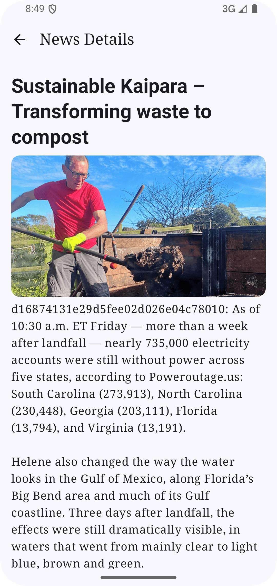
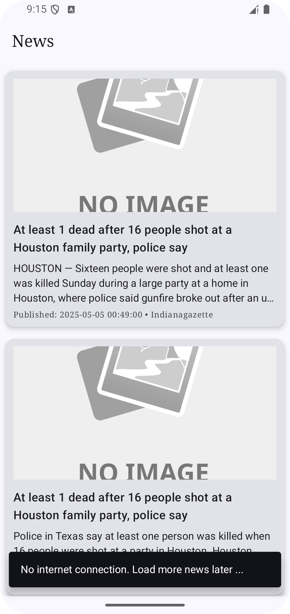

# 📰 NewsApp - Offline-First App

This is a simple Android news application built with Kotlin and Jetpack Compose. It uses a modern offline-first architecture to fetch news articles, 
display them in a scrollable list, and cache them using Room for offline access. The app follows MVVM and Clean Architecture principles.

## 📱 Screenshots

| News List Screen | Article Details | Offline Screen

<p float="left">
  
  
  
</p>

## 🚀 Features

- Fetch and display latest news articles
- Scrollable list with lazy loading and pagination
- Caching with Room for offline-first support
- Responsive UI with loading and error states
- Modern Compose UI with material theming
- TopAppBar that scrolls with content
- Modular and testable clean architecture

## 🛠️ Tech Stack

- **Language**: Kotlin
- **UI**: Jetpack Compose
- **Architecture**: MVVM + Clean Architecture
- **Dependency Injection**: Koin
- **Networking**: Ktor HTTP Client
- **Image Loading**: Coil
- **Local Storage**: Room
- **Navigation**: Jetpack Navigation Compose
- **State Management**: StateFlow & `collectAsState`
- **UI Components**: Extended Material Icons

## 📥 API
News articles are fetched from your chosen news API.

[(Go to the newsdata.io site and get an api-key: (https://newsdata.io/api/1/latest/add api-key here ))]

## 🧪 Testing
Manual testing has been performed to ensure:

News loads with both internet and cached data

Pagination loads additional articles smoothly

Error states are properly displayed

UI behaves responsively across devices


## 📦 Project Structure

```plaintext
com.ghost.newsapp
│
├── core/
│   ├── data/          # Repositories, DTOs, local & remote data sources
│   ├── di/            # Koin modules
│   ├── domain/        # Use cases and model entities
│   ├── navigation/    # Navigation graph setup
│   ├── presentation/  # UI screens, view models, and composables
│   ├── utils/         # Mappers, helpers, constants
│   └── App.kt         # Application class


All screenshots are stored in the screenshots/ folder.
